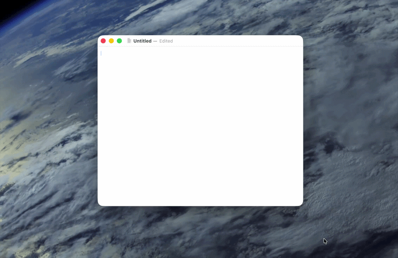

# Aura

Aura is a small native macOS menu bar dictation app. Hold a shortcut, speak, and it records audio, runs local transcription, then pastes the result into the focused app.

Everything runs locally on device.

## Installing

Download the latest version from Releases.

Latest version is `v0.1.1`
